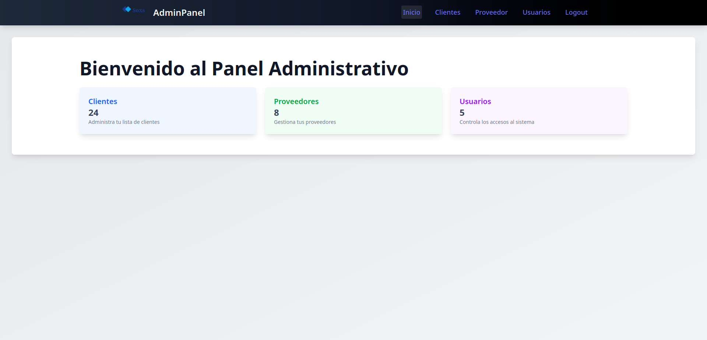

# Panel Administrativo - React App

**Panel Administrativo** es una aplicación web construida con **React** y **Tailwind CSS**, diseñada para gestionar **clientes**, **proveedores** y **usuarios**. Esta aplicación permite visualizar, editar y eliminar datos de clientes, proveedores y usuarios en un entorno interactivo y moderno.

## 🚀 **Características**

- **Vista de clientes, proveedores y usuarios**: Visualiza y administra las listas de clientes, proveedores y usuarios.
- **Navegación eficiente**: Utiliza **React Router** para navegar sin recargar la página.
- **Estilización moderna**: Usa **Tailwind CSS** para un diseño atractivo y responsivo.
- **Interacción con iconos**: Utiliza iconos de **React Icons** para las acciones de edición y eliminación.
- **Favicon personalizado**: Icono de la página personalizado con un logo de la aplicación.

## 🧑‍💻 **Tecnologías Usadas**

- **React**: Biblioteca JavaScript para construir la interfaz de usuario.
- **Tailwind CSS**: Framework CSS para diseñar de manera rápida y moderna.
- **React Router**: Para gestionar la navegación dentro de la aplicación.
- **React Icons**: Para agregar iconos interactivos a las acciones de la tabla.

## 🎨 **Capturas de Pantalla**

Aquí puedes ver cómo se ve la aplicación:



## 📝 **Instrucciones para ejecutar el proyecto**

### Requisitos previos

Asegúrate de tener **Node.js** y **npm** instalados en tu máquina.

1. **Clonar el repositorio**:

   Abre tu terminal y ejecuta:

   ```bash
   git clone https://github.com/tu-usuario/panel-administrativo.git
   ```

2. **Instalar dependencias**:

   Navega al directorio del proyecto y ejecuta el siguiente comando para instalar las dependencias necesarias:

   ```bash
   cd panel-administrativo
   npm install
   ```

3. **Ejecutar el proyecto**:

   Inicia el servidor de desarrollo con:

   ```bash
   npm run dev
   ```

4. **Acceder a la aplicación**:

   Abre tu navegador y ve a `http://localhost:5173/login` para ver la aplicación en funcionamiento, primero lo lleva a un login de prueba que no necesita datos y accedes
   a la pagina principal.

## 📂 **Estructura del Proyecto**

El proyecto tiene la siguiente estructura:

```
panel-administrativo/
├── public/
│   └── index.html          # Archivo principal HTML
├── src/
│   ├── assets/             # Archivos estáticos (logo.svg, etc.)
│   ├── components/         # Componentes reutilizables (Navbar, Layout)
│   ├── pages/              # Páginas principales (Clientes, Proveedor, Usuarios)
│   ├── App.jsx             # Componente principal de la aplicación
│   ├── main.jsx            # Entrada principal del proyecto
│   └── index.css           # Archivo de estilos globales
├── package.json            # Dependencias y scripts
└── README.md               # Este archivo
```

